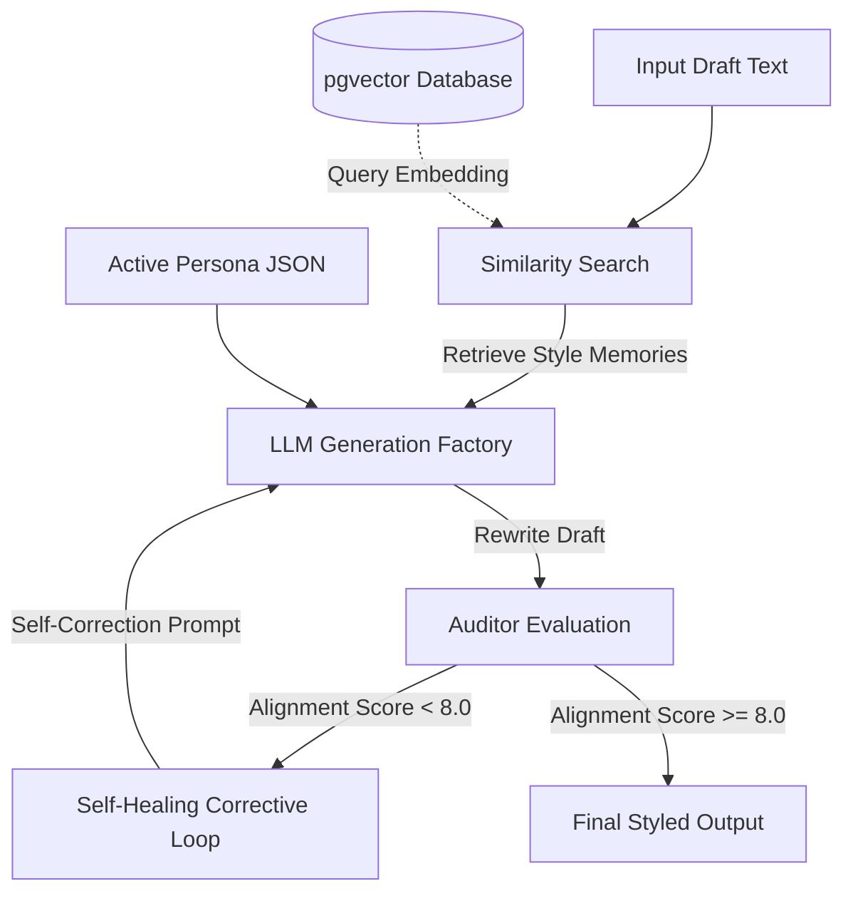

<div align="center">

# Resonate

An engineering-grade, AI-powered application that constructs a machine-readable identity layer to preserve, align, and refine your unique communication identity across various channels and platforms.

[](https://resonate-phi.vercel.app)
[](https://nextjs.org/)
[](https://www.typescriptlang.org/)
[](https://tailwindcss.com/)
[](https://supabase.com/)
[](https://stripe.com/)
[](https://openai.com/)
[](https://vitest.dev/)

</div>

---

## 📖 Overview

Generic AI outputs sound sterile, robotic, and inconsistent. **Resonate** solves this by modeling an individual's natural communication style into structured data (`identity_json`), then running a translation engine that adapts generic model drafts so they align with the user's specific tone, directness, formatting habits, and personal brand rules.

This repository serves as a **portfolio-quality implementation** designed to showcase clean code architecture, professional database design with Row-Level Security, multi-model routing abstraction, and automated prompt evaluation loops.

### 🌟 Key Highlights
- 🚀 **Interactive Demo Mode** – Test the full application experience with seeded mock timelines and active personas, completely offline and with no credentials needed.
- 🔄 **Self-Healing LLM Loop** – Multi-model pipeline featuring an autonomous auditor agent that evaluates and self-corrects style misalignment below an 8.0/10 threshold.
- 🧠 **Contextual Memory** – Uses cosine-similarity vector searches (`pgvector` + OpenAI embeddings) to inject personalized user guidelines into target prompts.
- 🔐 **Enterprise-Grade Security** – Comprehensive Postgres Row-Level Security (RLS) policies isolating user profiles, histories, and memories.
- ⚡ **Streamlined DX & Tests** – Standardized developer workflow (`Makefile`) and unit tests via Vitest achieving rapid test execution times (under 2 seconds).

---

## ⚡ Portfolio Demo Mode (No Setup Required)

Resonate includes a fully isolated **Demo Mode** specifically designed for recruiter and developer inspections. 

**👉 [Try the Live Demo (Runs in Demo Mode)](https://resonate-phi.vercel.app)**

By running in Demo Mode, the entire application works offline or without paid credentials:
- **Zero Configs**: Runs immediately without needing Supabase, Stripe, OpenAI, Gemini, or Redis keys.
- **In-Memory database simulation**: Emulates authentication sessions, user profiles, persona switches, settings updates, and billing checkouts entirely in memory.
- **Deterministic local simulation**: The text transformation engine runs an offline mock correction pass so you can explore the dashboard, editor, memory system, history log, and analytics.

### Quick Start:

```bash
# Clone the repository
git clone https://github.com/matthewubundi/resonate.git
cd resonate

# Install dependencies and start the demo server
npm install
npm run dev:demo
```
*Alternatively, you can run `make dev-demo` if you have `make` installed.*

Open [http://localhost:3000](http://localhost:3000), select **Start Demo**, and navigate to:
- `/dashboard` for simulated user activity and seeded timelines.
- `/transform` to run text rewrites through the mock correction pipeline.
- `/editor` to view and tweak the structured identity JSON profile.
- `/memory`, `/personas`, `/history`, and `/analytics` to inspect supporting dashboard workflows.
- `/architecture` to read the built-in system design breakdown.

---

## 🏗️ System Architecture & Highlights



### 1. The Self-Healing AI Translation Loop
Every rewrite request is sent to the LLM factory alongside the user's structured `identity_json`. 
1. **Auditing**: The output is evaluated by a secondary validation prompt (the *Auditor*) against the identity schema, scoring it on a scale of 1-10.
2. **Correction**: If the score is below the **8.0 threshold**, the engine automatically passes the text back to the generator with specific feedback detailing where it failed alignment rules, executing a self-correcting loop before rendering the final result.

### 2. Contextual Memory (Vector Search)
Resonate utilizes `pgvector` on Postgres database layers. When a user submits text for transformation, the engine generates an embedding of the input via OpenAI’s API, runs a cosine-similarity query matching user memories, retrieves the top 3 contextual guidelines, and feeds them into the generation prompt.

### 3. Provider Abstraction (LLM Factory)
The backend does not bind itself to a single LLM provider. The codebase uses a unified `ILLMProvider` interface. This allows Resonate to dynamically route users between models (e.g., GPT-4o-mini for free tiers, Google Gemini 2.5 Flash for pro/power tiers) based on billing status, fallback states, or query latency requirements.

### 4. Database Security (RLS)
Security is baked into the Postgres schema (`supabase/schema.sql`). All tables—`profiles`, `identities`, `identity_versions`, `memories`, and `transformations`—have Row-Level Security (RLS) enabled. Supabase authentication is wired directly into policies, ensuring that users can only read, write, update, or delete data belonging to their own `auth.uid()`.

---

## 🛠️ Tech Stack & Folder Structure

### Folder Layout:
```
resonate/
├── app/                    # Next.js 16 App Router (shell & API endpoints)
│   ├── [locale]/           # Regionalized routes (en, fr, de)
│   └── api/                # Protected API endpoints
├── components/            # Shared view components
│   ├── ui/                # Base design system primitives
│   └── HeroBackground.tsx # Canvas-based interactive backdrop
├── contexts/             # React authentication and session contexts
├── docs/                 # Comprehensive documentation specs
│   ├── architecture/     # System layout & auth flows
│   ├── api/              # API Specs and Database Schema
│   └── ai-logic/         # Prompt registries & evaluation thresholds
├── hooks/                # Custom React hook helpers (onboarding, settings)
├── lib/                  # LLM Factory Providers, Supabase clients, and logic
├── supabase/             # Database migrations & SQL schema
├── views/                # Modular dashboard page components
├── vitest.config.ts      # Unit testing configurations
└── Makefile              # Command shortcut registry
```

---

## ⚙️ Production Deployment

To run Resonate in production mode with live APIs and databases, set up your variables:

1. **Database Setup**: Execute `supabase/schema.sql` inside your Supabase project's SQL editor to initialize tables, vector indexes, triggers, and RLS policies.
2. **Configure Environment Variables**: Create a `.env.local` file:
   ```env
   # Application URL
   NEXT_PUBLIC_BASE_URL=http://localhost:3000

   # Supabase Credentials
   NEXT_PUBLIC_SUPABASE_URL=your-project-url.supabase.co
   NEXT_PUBLIC_SUPABASE_ANON_KEY=your-anon-key-here
   SUPABASE_SERVICE_ROLE_KEY=your-service-role-key-here

   # LLM Keys
   OPENAI_API_KEY=your-openai-api-key-here
   GEMINI_API_KEY=your-gemini-api-key-here

   # Billing Integration (Stripe)
   STRIPE_SECRET_KEY=sk_test_...
   NEXT_PUBLIC_STRIPE_PUBLISHABLE_KEY=pk_test_...
   STRIPE_WEBHOOK_SECRET=whsec_...
   ```

3. **Compile & Start**:
   ```bash
   # Build the server
   npm run build
   
   # Start the production bundle
   npm run start
   ```

---

## 🔧 Developer Experience (DX)

A `Makefile` is provided to keep development workflows clean and simple:

```bash
make dev         # Start Next.js development server
make dev-demo    # Start development server in offline Demo Mode
make build       # Compile production build
make build-demo  # Compile production build in Demo Mode
make lint        # Run ESLint validation
make test        # Run unit tests via Vitest
```

All unit tests are located in `__tests__` subdirectories and run on top of standard JSDom testing libraries, achieving rapid test execution times (under 1 second).

---

## 📝 Engineering Notes & Tradeoffs

### 1. Client-Side Page Router Shell (SPA-like Container)
Resonate leverages an `<App />` container wrapper inside a Next.js App Router frame. This design was specifically chosen to support the **Portfolio Demo Mode**. By abstracting page state through client view switching, the application can switch between full Supabase authentication layouts and completely offline, mock-based user views seamlessly, without needing server-side page guards to redirect during demo runs.

### 2. High-Density Vector Search Indexing
For the memory similarity searches, the Postgres DB uses an `HNSW` index:
```sql
create index if not exists idx_memories_embedding on memories 
  using hnsw (embedding vector_cosine_ops)
  with (m = 16, ef_construction = 64);
```
While HNSW indexes consume more build time and memory overhead compared to `IVFFlat`, they provide significantly faster query recall speeds for small-to-medium user memory lists—essential for maintaining sub-second response times during live text transformation pipelines.

---

## 🛡️ License

Resonate is open-source software licensed under the [MIT License](./LICENSE).
